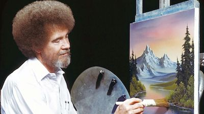

# The Joy of Emacs :evergreen_tree::evergreen_tree:

## Welcome to The Joy of Emacs

My name is Michael Utz, and I am excited to share _The Joy of Emacs_
with you.

If you're like me, you've been interested in Emacs for a long time,
but you never had time to figure out what all the hype is about.

This Emacs config is here to show you just that!

## Why experience The Joy of Emacs?

> “You, too, can paint almighty pictures.” :sunrise:

1. Emacs is incredibly powerful.
    - There's almost nothing you _can't_ do with Emacs.
1. Emacs is incredibly customizable.
    - Emacs has a built-in programming language called [Emacs
    Lisp](https://www.gnu.org/software/emacs/manual/html_node/elisp/),
    that you can use to change nearly _anything_ about your editor.
1. Emacs has _excellent_ Vim keybindings.
    - If you don't know what that means, it's ok.

## Why make The Joy of Emacs?

> “I taught my son to paint mountains like these, and guess what? Now
> he paints the best darn mountains in the industry.”

There are some absolutely _incredible_ beginners tools for Emacs out
there. Both [Spacemacs](https://www.spacemacs.org) and [Doom
Emacs](https://github.com/hlissner/doom-emacs) are phenomenal
distros1 that are worth your time. I learned a ton from them.

The community around Emacs is great. There are _tons_ of tutorials,
blogs, and articles out there, too. Emacs has a great
[Reddit](https://www.reddit.com/r/emacs/) community. Heck, Emacs even
has it's own [Stack Exchange](https://emacs.stackexchange.com)!

**But the true joy of Emacs doesn't come from just _using_ it--it comes
from _hacking_ it.**

So, I've attempted here to bring newcomers along on a journey of
finding the joy that people have been exploring since 1976. I hope you
enjoy the ride!

> “You can do anything you want to do. This is your world.”

## Who is Bob Ross?

[Bob Ross](https://www.youtube.com/user/BobRossInc) is an American
painter who hosted a show on public broadcasting where he taught
people how to paint. His happy, calm approach to painting inspired
millions of people who were afraid of starting a new hobby.

I've included a bunch of his quotes throughout this config, just to
keep things light.2

## What do I do next?

> “Just let go — and fall like a little waterfall.”

The Joy of Emacs lives in a file in this repository called
`the-canvas.org`. One of the coolest things about Emacs is it's
ability to mix prose with code. I've used that style here to help
communicate better.

_To continue on our journey of learning how to really use Emacs, click
this link to visit [`the-canvas.org`](the-canvas.org)._

---

1 The word `distro` is short for "distribution". It's just
an easy way to put a whole bunch of cutomizations together in a single
place for users to get started easily with Emacs.

2 Unless otherwise noted, all the quotes in this repository are from Bob Ross.
